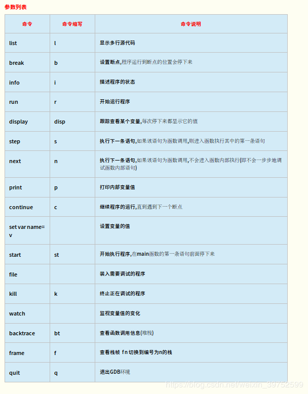
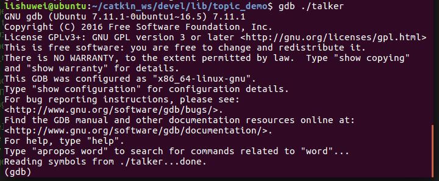
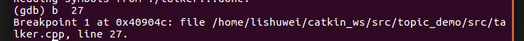
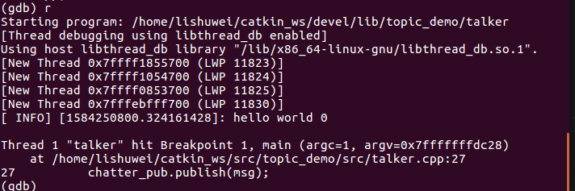
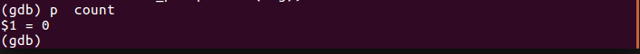
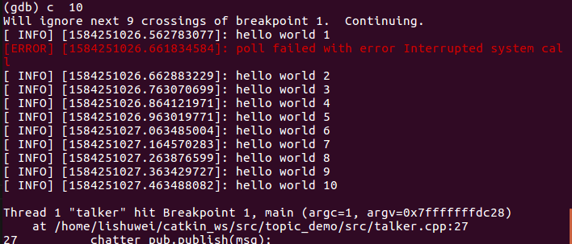

ROS下面gdb调试：

1. roboware studio这个软件

参考这个软件说明书，很详细介绍建立功能包创建，调试

软件包和说明书见：https://github.com/lishuwei0424/ROS-xiaobai

2. gdb调试

假如有一个功能包：topic_demo (下载见上面的Github地址)

具体：

CMakeLists.txt增加debug模式：

set(CMAKE_BUILD_TYPE Debug)

然后：

gdb使用可参考 https://www.yanbinghu.com/2019/04/20/41283.html

如下简单介绍：

选择可执行文件talker节点，在~/catkin_ws/devel/lib/topic_demo/文件下，对应的源文件：

   $gdb 可执行文件 ;进入调试模式

​      $b 行号；打断点

​    

$r arg1 arg2；增加命令行参数

$p 变量名；打印变量值

$s ；单步进入

$n ；单步运行

$c 次数；跳过断点的次数

  

 